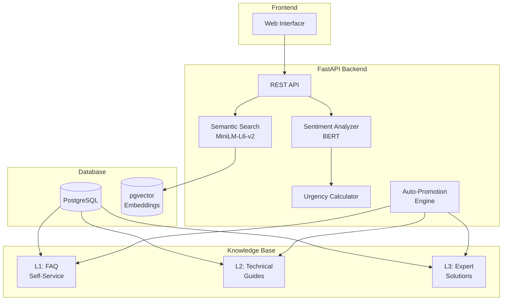

<p align="center">
  <h1 align="center">🧠 SupportIQ</h1>
  <p align="center">
    <strong>Intelligent IT Support Automation via Tiered RAG</strong>
  </p>
  <p align="center">
    <em>Combining MiniLM Semantic Search & BERT Sentiment Analysis for Smart Ticket Resolution</em>
  </p>
</p>

<p align="center">
  
  
  
  
  
</p>

---

## 📖 Overview

**SupportIQ** is an intelligent IT support automation platform that leverages Retrieval-Augmented Generation (RAG) with a tiered knowledge base architecture. It automatically analyzes incoming support tickets, determines urgency levels using BERT sentiment analysis, and retrieves relevant solutions using semantic search powered by sentence transformers.

### ✨ Key Features

| Feature | Description |
|---------|-------------|
| 🔍 **Semantic Search** | MiniLM-L6-v2 embeddings with 384-dimensional vectors for accurate query understanding |
| 🎯 **Hybrid Search** | Combines semantic similarity (70%) + keyword matching (30%) for optimal results |
| 💬 **BERT Sentiment Analysis** | Multilingual sentiment classification for ticket prioritization |
| 📊 **Dynamic Urgency Scoring** | 1-10 urgency scores based on sentiment, keywords, and issue type |
| 📚 **Tiered Knowledge Base** | L1 (FAQ) → L2 (Technical) → L3 (Expert) knowledge hierarchy |
| 🔄 **Auto-Promotion Engine** | Automatically promotes frequently resolved solutions between tiers |
| 🗄️ **PostgreSQL + pgvector** | Enterprise-grade vector storage for semantic embeddings |
| 🖥️ **Modern Web UI** | Beautiful, responsive interface for ticket management |

---

## 🏗️ Architecture



### Knowledge Tier System

| Tier | Description | Auto-Promotion Threshold |
|------|-------------|-------------------------|
| **L1** | FAQ / Common Issues (Self-service) | - |
| **L2** | Technical Guides (Moderate complexity) | L3 → L2: 10+ uses with 4.0+ feedback |
| **L3** | Expert Solutions (Specialist knowledge) | L2 → L1: 25+ uses with 4.0+ feedback |

---

## 🚀 Quick Start

### Prerequisites

- **Python 3.10+**
- **Docker & Docker Compose** (for PostgreSQL with pgvector)
- **4GB+ RAM** (for ML models)

### 1. Clone the Repository

```bash
git clone https://github.com/yourusername/supportiq.git
cd supportiq
```

### 2. Set Up Environment

```bash
# Create virtual environment
python -m venv .venv

# Activate (Windows)
.venv\Scripts\activate

# Activate (Linux/Mac)
source .venv/bin/activate

# Install dependencies
pip install -r requirements.txt
```

### 3. Configure Environment Variables

```bash
# Copy example environment file
cp .env.example .env

# Edit .env with your settings (defaults work for local development)
```

<details>
<summary><strong>📋 Environment Variables Reference</strong></summary>

| Variable | Default | Description |
|----------|---------|-------------|
| `DATABASE_URL` | `postgresql+asyncpg://...` | Async database connection string |
| `DATABASE_URL_SYNC` | `postgresql://...` | Sync database connection string |
| `DEBUG` | `True` | Enable debug mode |
| `API_PREFIX` | `/api/v1` | API route prefix |
| `MINILM_MODEL` | `sentence-transformers/all-MiniLM-L6-v2` | Semantic search model |
| `BERT_SENTIMENT_MODEL` | `nlptown/bert-base-multilingual-uncased-sentiment` | Sentiment analysis model |
| `SEMANTIC_WEIGHT` | `0.7` | Weight for semantic similarity in hybrid search |
| `KEYWORD_WEIGHT` | `0.3` | Weight for keyword matching in hybrid search |
| `TOP_K_RESULTS` | `5` | Number of search results to return |
| `L3_TO_L2_THRESHOLD` | `10` | Usage count to promote L3 → L2 |
| `L2_TO_L1_THRESHOLD` | `25` | Usage count to promote L2 → L1 |
| `MIN_FEEDBACK_SCORE` | `4.0` | Minimum feedback score for promotion |

</details>

### 4. Start PostgreSQL Database

```bash
# Start PostgreSQL with pgvector using Docker
docker-compose up -d

# Wait for database to be ready (health check included)
docker-compose logs -f postgres
```

### 5. Run the Application

```bash
# Start the FastAPI server
python -m uvicorn app.main:app --host 0.0.0.0 --port 8000 --reload
```

The application will be available at:
- **Web UI**: http://localhost:8000
- **API Docs (Swagger)**: http://localhost:8000/docs
- **API Docs (ReDoc)**: http://localhost:8000/redoc

> ⚠️ **Note**: First startup will download ML models (~500MB). This may take 1-2 minutes.

---

## 📡 API Reference

### Endpoints Overview

| Category | Endpoint | Method | Description |
|----------|----------|--------|-------------|
| **Health** | `/api/v1/health` | GET | System health check |
| **Tickets** | `/api/v1/tickets` | POST | Create new ticket with auto-analysis |
| | `/api/v1/tickets` | GET | List tickets with filters |
| | `/api/v1/tickets/{id}` | GET | Get ticket details |
| | `/api/v1/tickets/{id}/resolve` | POST | Resolve ticket |
| **Search** | `/api/v1/search` | POST | Semantic search knowledge base |
| | `/api/v1/search/similar/{id}` | GET | Find similar tickets |
| **Knowledge** | `/api/v1/knowledge` | GET | List knowledge base entries |
| | `/api/v1/knowledge` | POST | Create new entry |
| | `/api/v1/knowledge/{id}` | GET | Get specific entry |
| | `/api/v1/knowledge/categories` | GET | Get categories with counts |
| **Promotion** | `/api/v1/promotion/candidates` | GET | Get promotion candidates |
| | `/api/v1/promotion/run` | POST | Trigger auto-promotion |
| | `/api/v1/promotion/{id}` | POST | Manually promote entry |
| | `/api/v1/promotion/history` | GET | Get promotion history |
| **Analytics** | `/api/v1/analytics` | GET | Dashboard analytics |
| **Utility** | `/api/v1/analyze` | GET | Text sentiment/urgency analysis |

### Example: Create a Ticket

```bash
curl -X POST "http://localhost:8000/api/v1/tickets" \
  -H "Content-Type: application/json" \
  -d '{
    "title": "Payment system is completely down!",
    "description": "Unable to process any transactions. Customers are complaining. This is urgent!",
    "user_email": "user@example.com"
  }'
```

**Response:**
```json
{
  "id": 1,
  "title": "Payment system is completely down!",
  "status": "open",
  "urgency_score": 9,
  "urgency_level": "critical",
  "sentiment": {
    "label": "very_negative",
    "score": -0.95
  },
  "assigned_tier": "L3",
  "suggested_solutions": [
    {
      "id": 14,
      "title": "Payment Processing System Errors",
      "tier": "L3",
      "similarity_score": 0.89
    }
  ]
}
```

---

## 🧠 ML Models

### Sentence Transformers (MiniLM-L6-v2)

Used for semantic search and embedding generation:
- **Dimensions**: 384
- **Max Sequence Length**: 256 tokens
- **Use Case**: Query understanding, similar ticket matching, knowledge retrieval

### BERT Sentiment Analysis

Multilingual sentiment classification model:
- **Output**: 5-class (1-5 stars → very_negative to very_positive)
- **Languages**: Supports 6+ languages
- **Use Case**: Ticket sentiment analysis, urgency calculation

---

## 🔄 Urgency Scoring Algorithm

The dynamic urgency score (1-10) is calculated using multiple factors:

```python
urgency_score = (
    sentiment_factor      # 40% - BERT sentiment analysis
    + keyword_factor      # 30% - Critical/high urgency keywords
    + category_factor     # 20% - Issue type classification
    + base_score         # 10% - Baseline
)
```

### Urgency Level Mapping

| Score | Level | Tier Assignment |
|-------|-------|-----------------|
| 1-3 | Low | L1 |
| 4-5 | Medium | L1/L2 |
| 6-7 | High | L2 |
| 8-10 | Critical | L3 |

### Critical Keywords (Instant Priority Boost)

```
payment, security, breach, outage, down, emergency, critical
```

---

## 📁 Project Structure

```
supportiq/
├── app/
│   ├── __init__.py           # Version info
│   ├── main.py               # FastAPI application entry
│   ├── config.py             # Configuration management
│   ├── api/
│   │   ├── routes.py         # REST API endpoints
│   │   └── schemas.py        # Pydantic models
│   ├── database/
│   │   └── connection.py     # Database connection handling
│   ├── models/
│   │   ├── ticket.py         # Ticket ORM models
│   │   └── knowledge.py      # Knowledge base models
│   └── services/
│       ├── semantic_search.py  # MiniLM semantic search
│       ├── sentiment.py        # BERT sentiment analysis
│       ├── urgency.py          # Dynamic urgency scoring
│       ├── knowledge_base.py   # Knowledge base operations
│       └── auto_promote.py     # Auto-promotion engine
├── static/
│   ├── index.html            # Web UI
│   ├── app.js                # Frontend JavaScript
│   └── styles.css            # Styling
├── scripts/
│   └── init_db.sql           # Database initialization
├── tests/                    # Test suite
├── docker-compose.yml        # PostgreSQL + pgvector
├── requirements.txt          # Python dependencies
├── .env.example              # Environment template
└── README.md                 # This file
```

---

## 🧪 Testing

```bash
# Run all tests
pytest

# Run with coverage
pytest --cov=app --cov-report=html

# Run specific test file
pytest tests/test_api.py -v
```

---

## 🐳 Docker Deployment

### Using Docker Compose

```bash
# Start all services
docker-compose up -d

# View logs
docker-compose logs -f

# Stop services
docker-compose down

# Stop and remove volumes
docker-compose down -v
```

---

## 📊 Database Schema

### Core Tables

| Table | Description |
|-------|-------------|
| `tickets` | Support tickets with status, urgency, sentiment |
| `ticket_embeddings` | 384-dim vector embeddings for tickets |
| `resolutions` | Resolution details and user feedback |
| `knowledge_base` | Tiered knowledge entries with embeddings |
| `promotion_history` | Auto-promotion audit trail |

### Key Indexes

- **IVFFlat** indexes for vector similarity search
- **GIN** indexes for full-text search
- Standard B-tree indexes for filtering

---

## 🔧 Configuration Options

### Search Tuning

Adjust the hybrid search balance in `.env`:

```bash
# More semantic focus (better for conceptual queries)
SEMANTIC_WEIGHT=0.8
KEYWORD_WEIGHT=0.2

# More keyword focus (better for exact matches)
SEMANTIC_WEIGHT=0.5
KEYWORD_WEIGHT=0.5
```

### Auto-Promotion Thresholds

```bash
# Faster promotion (more aggressive)
L3_TO_L2_THRESHOLD=5
L2_TO_L1_THRESHOLD=15

# Slower promotion (more conservative)
L3_TO_L2_THRESHOLD=20
L2_TO_L1_THRESHOLD=50
```

---

## 🤝 Contributing

1. Fork the repository
2. Create a feature branch (`git checkout -b feature/amazing-feature`)
3. Commit your changes (`git commit -m 'Add amazing feature'`)
4. Push to the branch (`git push origin feature/amazing-feature`)
5. Open a Pull Request

---

## 📄 License

This project is licensed under the MIT License - see the [LICENSE](LICENSE) file for details.

---

## 🙏 Acknowledgments

- [Sentence Transformers](https://www.sbert.net/) - MiniLM embeddings
- [Hugging Face](https://huggingface.co/) - BERT models
- [FastAPI](https://fastapi.tiangolo.com/) - Modern API framework
- [pgvector](https://github.com/pgvector/pgvector) - Vector similarity for PostgreSQL

---

<p align="center">
  Made with ❤️ by the SupportIQ Team
</p>
